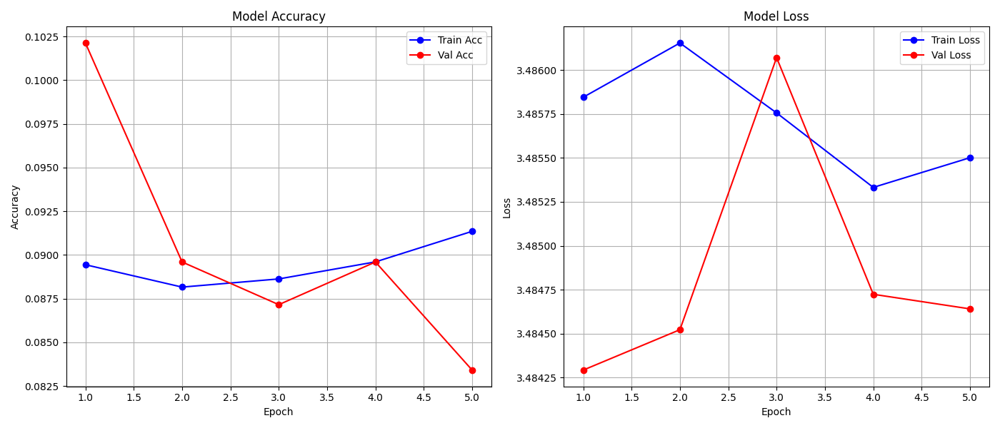
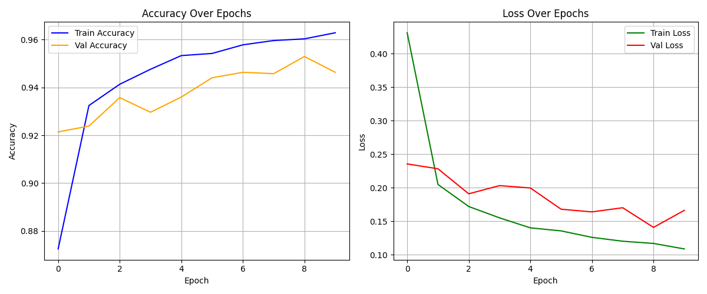
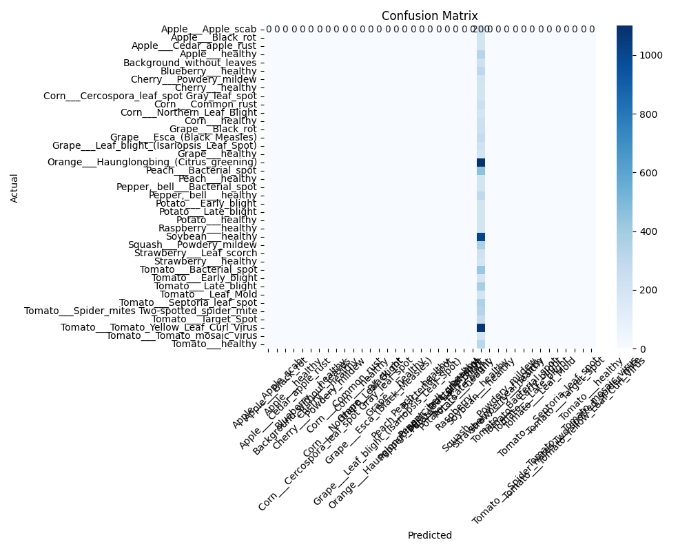

# 🌿 Plant Disease Detection using EfficientNetB0
This project uses EfficientNetB0, a state-of-the-art Convolutional Neural Network (CNN), to detect and classify plant leaf diseases from images. It leverages transfer learning and image augmentation to achieve accurate classification across multiple plant species and disease categories.

🔧 Features:
✅ Built on EfficientNetB0 pretrained on ImageNet

✅ Supports resume training from checkpoints

✅ Configurable via config.yaml

✅ Includes model evaluation with:

✅ Confusion matrix

✅ Classification report

✅ Accuracy & loss plots

✅ Example prediction visualization

✅ Trained using ImageDataGenerator with real-time data augmentation
---
## 📦 Dataset

We used a dataset from **Mendeley Data**:

🔗 [Plant Leaf Disease Dataset](https://data.mendeley.com/datasets/tywbtsjrjv/1)

This dataset contains **61,486 images** across **39 different classes**, including both healthy and diseased leaves. It includes various plants such as tomato, apple, corn, grape, strawberry, and more.

> Images were augmented using techniques like flipping, gamma correction, noise injection, PCA color augmentation, rotation, and scaling.


### 📥 Clone the Repository

You can either:

**Clone using Git:**

```bash
git clone https://github.com/Qasimhussain5753/plant-disease-detection.git
```

### 🔧 Install Dependencies

To install all required Python packages, run:

```bash
pip install -r requirements.txt
```

### 📥 Download the Dataset

Run the following script to automatically download the PlantVillage dataset into the `dataset/` directory:

```bash
python /scripts/download_dataset.py
```


## 🏗️ Training the Model

The training script is located in the `scripts/` directory.

### 📌 Steps to Train

From your terminal, run the following command from the project root:

```bash
python scripts/train_model.py
```

> ⚠️ **Note:** Training can take several minutes or hours depending on your system.


### 🎯 Output Files

After training, the following files will be created in the `models/` directory:

- **`model.h5`** – The trained CNN model used for predictions.
- **`class_indices.pkl`** – A dictionary mapping class indices to class names. This is used during prediction to display readable class labels.
- **`history.pkl`** – Contains training history (accuracy and loss per epoch) and is used to plot performance graphs.
- **`Checkpoints`**  Checkpoints are saved during training to allow resuming later, especially since training the model takes a significant amount of time.


## 📈 Visualizing Training Metrics

You can visualize the training and validation accuracy/loss using the `print_chart.py` script.

### ▶️ Run the Chart Script

```bash
python scripts/print_chart.py
```

This script reads the `history.pkl` file and generates performance plots like the one below:

### Prev Accuracy and Loss Plot ###



### New Accuracy and Loss Plot ###


- **Left Chart**: Accuracy over epochs (Train vs Validation)
- **Right Chart**: Loss over epochs (Train vs Validation)


### Confusion Matrix ###


This visualization helps understand how well the model is learning and if it's overfitting.

---

## 🧪 Predicting Leaf Diseases

After training, you can test the model using `predict_test_images.py`.

### 📌 Steps to Predict

1. Place test images in the `testData/` directory.
   - You can use the sample images or add your own.
2. From the main directory, run:

```bash
python predict_test_images.py
```

The model will analyze each image and print the predicted class in the terminal.

### ✅ Example Output

```
testData/test_leaf2.jpg
1/1 ━━━━━━━━━━━━━━━━━━━━ 0s 66ms/step
Predicted class: Strawberry___Leaf_scorch
```

---

## 🗂️ Project Structure

```
pplant-disease-detection/
├── dataset/                          # Leaf image categories (already available)
├── models/
│   ├── model.h5                      # Trained CNN model
│   ├── class_indices.pkl            # Mapping of class indices to class names
│   └── history.pkl                  # Training history for plotting
├── checkpoints/                     # Model checkpoints saved after each epoch
│   ├── model-epoch-01.weights.h5
│   ├── model-epoch-02.weights.h5
│   ├── model-epoch-03.weights.h5
│   ├── model-epoch-04.weights.h5
│   ├── model-epoch-05.weights.h5
│   ├── model-epoch-06.weights.h5
│   ├── model-epoch-07.weights.h5
│   ├── model-epoch-08.weights.h5
│   ├── model-epoch-09.weights.h5
│   └── model-epoch-10.weights.h5
├── scripts/
│   ├── train_model.py               # Model training script
│   └── print_chart.py              # Script to visualize training metrics
├── testData/                        # Images for prediction
├── predict_test_images.py          # Script to predict diseases from test images
├── config.yaml                      # Configuration file
├── requirements.txt                 # Project dependencies
├── confusion_matrix.png            # Confusion matrix plot
├── new_accuracy_figure.png         # Updated accuracy figure
├── prev_accuracy_figure.png        # Previous accuracy figure
├── temp_uploaded_image.jpg         # Temporary uploaded image
├── training_metrics.png            # Metrics plot (e.g., loss/accuracy)
└── README.md                       # Project documentation

```

---

## 👥 Author

- **Qasam Hussain** – [GitHub](https://github.com/Qasimhussain5753) · [LinkedIn](https://linkedin.com/in/qasam-hussain-53a54912b)

## 📃 License

This project is for **academic and educational use**. The dataset is publicly available via [Mendeley Data](https://data.mendeley.com/datasets/tywbtsjrjv/1).

---

Happy coding and good luck detecting plant diseases! 🌱🧠🖼️
